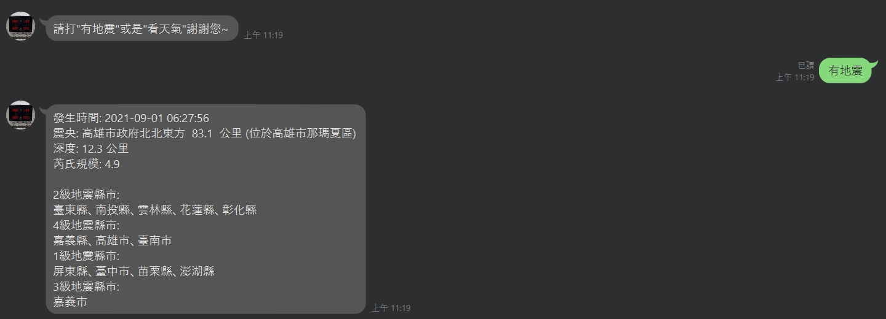

# How to build a own LineBOT

## Before starting 
```
Create a account with Line 
Create a account with Heroku(free) 
```

## The main idea
Since there is many earthquake in Taiwan
if we need to quickly to know the information of eqrthquake
this process can know information from official
```
1. Get Messaging API from 【Line Developers】
2. Write a linbot request in 【Python】
3. Get a free website server and domainfrom 【Heroku】 
```

## STEP 1： get Messaging API from 【Line Developers】
Since HTML only provide a interface to display thoe code, it needs Javascript to make the program works.<br>
The whole code is on ```cal_v2.html```<br><br>
<br>

## STEP 2： write a linbot request in 【Python】
<b>000webhost</b> provide a free website server that you can pop code or even data library on it.<br><br>
First, create a account and sign in.<br>
<br>

Seocnd, create a new project<br>

Third, go：Tools/File Manager, pop the code you write on STEP 1(remember to change the name to "index.html")<br>
<br>

Now your code is on ```xxxxxxx.000webhostapp.com```.<br>

But the website link which 000webhost provides is too long and hard memroize. Fortunately, we could use the other domain which Freenom provide from to shorter our website link.<br><br>
Fourth, go：Tools/Set Web Address to **Park domain**<br>
<br>

Type the Domain name.<br>


## STEP 3： get a free website server and domainfrom 【Heroku】
<b>Freenom</b> provide a free website domain such as ```.ga``` or ```.tk```  ...<br>

First,  create a account and sign in.<br>
<br>

Second, choose the domian you want.(under 12 months is free, and if 12 months is done, it will ask you wheather want to extend)<br>
It will mail you when your domian is ready.<br>
<br>

Third,  go to： freenom/my domain/Management Tools/Use custom nameservers and type：<br><br>
  Nameserver 1<br>
  ```ns01.000webhost.com```<br>
  Nameserver 2<br>
  ```ns02.000webhost.com```<br><br>
to link to 000webhost.com<br>
<br>

After serveral times(usually 1 day), check 000webhost<br>
<br>

If you see the subdomian your website is ready on ```xxxxxxx.ga``` !<br>
<br>

##
if you want to know more clearly about the process, welcome to watch my youtube channel.<br>
<a href="https://majaja068.github.io/build-a-own-website/cal_v2.html">on github.io</a>
