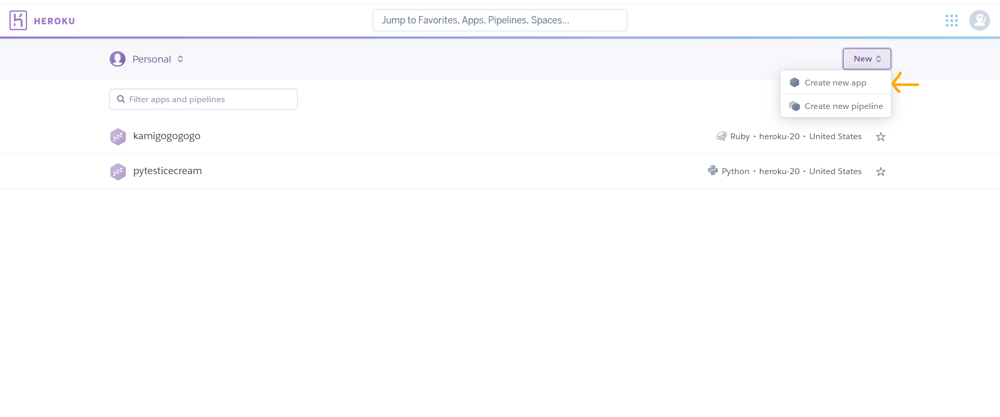
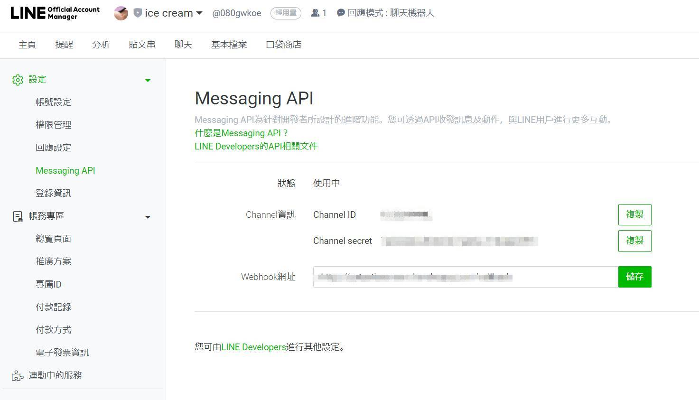
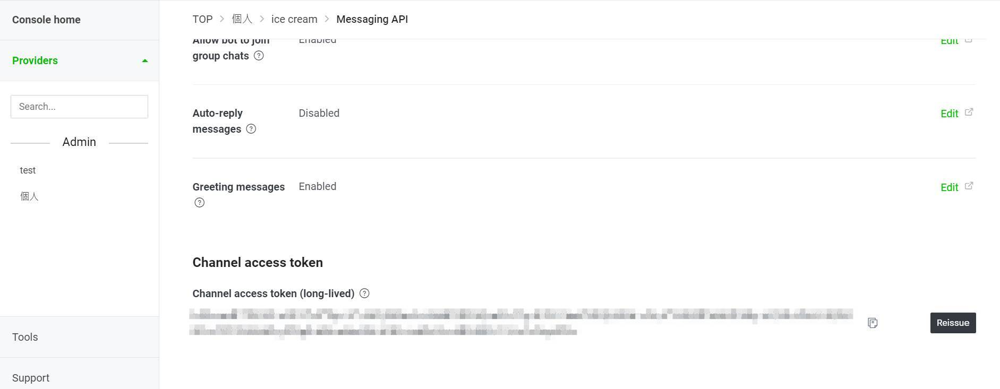

# How to build a own LineBOT

## Before starting 
```
1. Create a account with Line  (free) 
2. Create a account with Heroku(free) 
```

## The main idea
Since there is many earthquake in Taiwan
if need to know the information of eqrthquake in Taiwan.<br>
This process can know information from ```https://data.gov.tw/dataset/xxxx```
```
1. Get a free website server【Heroku】 
2. Get Messaging API from channel token【Line Developers】
3. Set a linbot program【Python】
```

## STEP 1： Create a Heroku project
Login to Heroku, in the Heroku page，select New -> Create New App.<br>
Then the project can be created.<br><br>
<br>

## STEP 2： Get Messaging API from and channel token【Line Developers】
Cause create a need process of the LineBot need the authorization, token and something else form Line Developers.<br><br>
<br>
<br>

## STEP 3： Set a linbot program【Python】

Firet, Heroku application need some files<br>

Let it know the type of application you have enabled,
what environment it needs, what conditions it has, what additional packages and so on.
These special files are Procfile, requirements.txt, and runtime.txt.<br><br>

1. Procfile 

Talk to Heroku,what type of application needed and what the program in the file need to do.
This LineBot is the ```web``` type, so assume that the program is app_core,
therefore the **Procfile** will wirte like this.<br><br>
```web gunicorn app:app```

2. requirements.txt

Talk the **Heroku** need to install what kits.
Heroku provides server is this program where it actually runs,
and in this project need the install kits are<br><br>

```
flask
gunicorn
line-bot-sdk
```

3. runtime.txt
This file tells Heroku which version of Python we want to run our application. 
Generally speaking, it doesn't matter if there is none.
Heroku is very smart and will choose the default version, 
which is usually the more stable version.
SO there didn't to write in this project.<br><br>

Seocnd, push the folder to **Heroku**<br>

The first push need to wirte like this<br>
```
heroku git:remote -a your-app-name
git add .
git commit -m "xxxx"
push
```
And in the feature,
if need to push this folder to **Heroku**
only need to write
```
git add .
git commit -m "xxxx"
push
```
The whole can see in the ```app.py```.<br><br>
